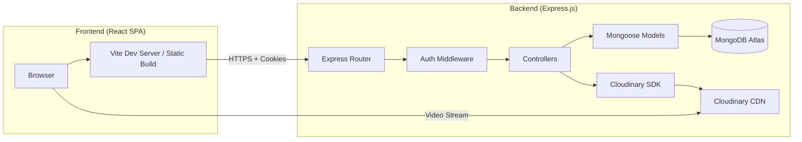
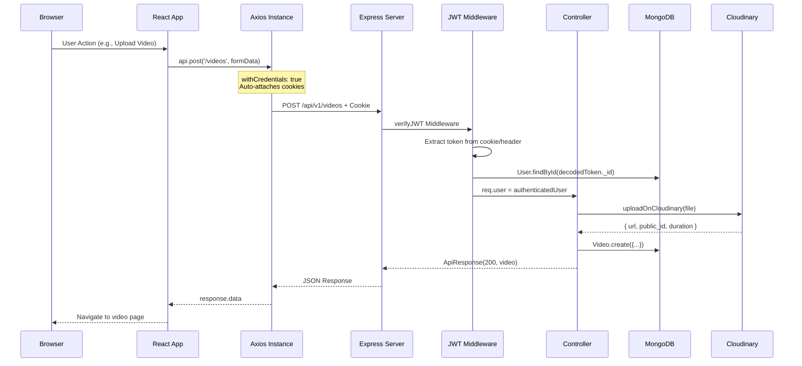
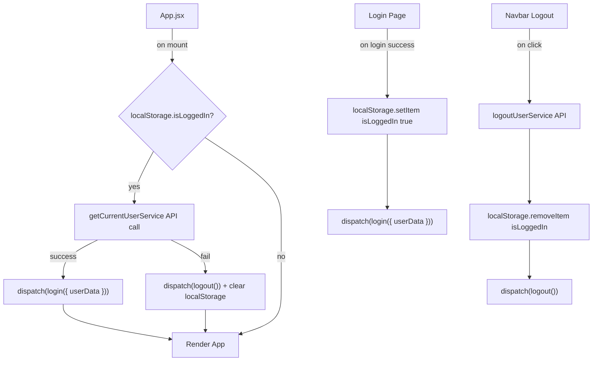
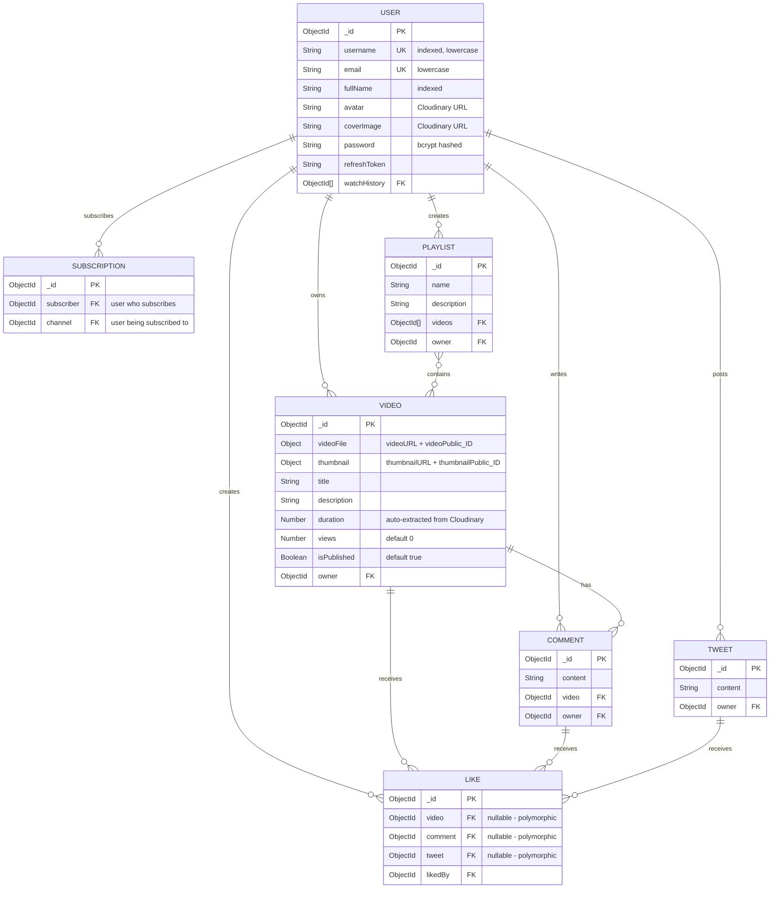
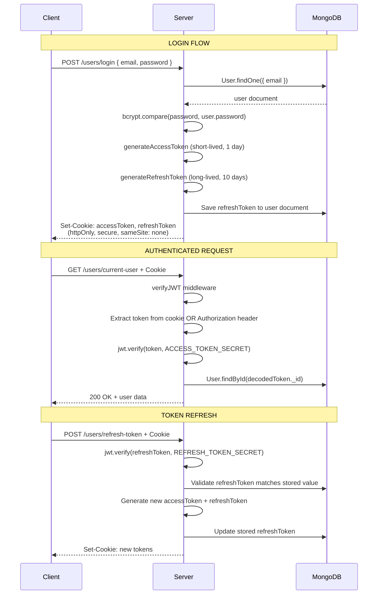
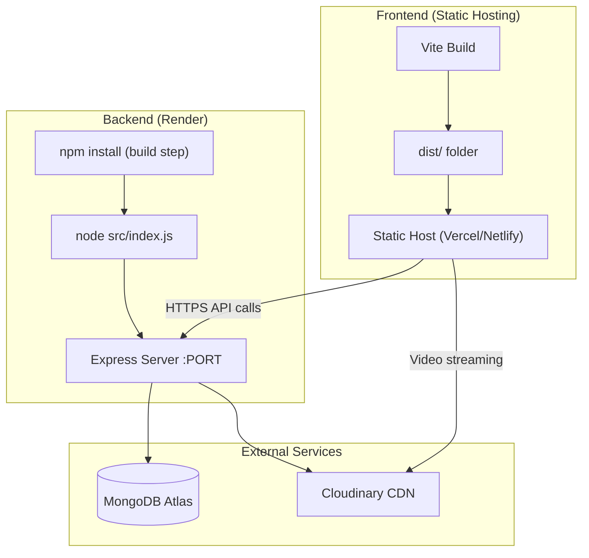

# 🎬 CoolTube — Full-Stack Video Streaming Platform

<div align="center">


A production-grade, YouTube-inspired video streaming platform built with the **MERN stack**. Features video upload & streaming via Cloudinary CDN, dual JWT authentication with HTTP-only cookies, MongoDB aggregation pipelines, playlist management, and a fully responsive React frontend with Redux state management.

[Live Demo](https://learning-backend-n440.onrender.com) · [Report Bug](../../issues) · [Request Feature](../../issues)

</div>

---

## 📑 Table of Contents

- [Project Overview](#-project-overview)
- [Tech Stack](#-tech-stack)
- [Architecture](#-architecture)
- [Backend Deep Dive](#-backend-deep-dive)
- [Frontend Deep Dive](#-frontend-deep-dive)
- [Database Schema](#-database-schema)
- [API Endpoints](#-api-endpoints)
- [Authentication Flow](#-authentication-flow)
- [Key Features](#-key-features)
- [Project Structure](#-project-structure)
- [Getting Started](#-getting-started)
- [Environment Variables](#-environment-variables)
- [Deployment](#-deployment)
- [Contributing](#-contributing)

---

## 🎯 Project Overview

**CoolTube** is a scalable, full-stack video-sharing platform that replicates core YouTube functionality. The system is architected as a **decoupled client-server application** with a RESTful API backend and a modern React SPA frontend, deployed independently to support separate scaling and CI/CD pipelines.

| Dimension | Details |
|-----------|---------|
| **Architecture** | Decoupled Monolith (REST API + SPA) |
| **Backend** | Node.js, Express.js, MongoDB (Mongoose ODM) |
| **Frontend** | React 19, Redux Toolkit, React Router v7, Tailwind CSS v4 |
| **Media Pipeline** | Multer (disk-buffered upload) → Cloudinary CDN (auto-transcoding) |
| **Auth** | Dual JWT (Access + Refresh Tokens), HTTP-only Secure Cookies |
| **Deployment** | Backend: Render · Frontend: Static hosting (Vite build) |
| **Database** | MongoDB Atlas (cloud-hosted) |

---

## 🛠 Tech Stack

### Backend

| Technology | Version | Purpose |
|---|---|---|
| **Node.js** | 18+ | JavaScript runtime with ES Module support (`"type": "module"`) |
| **Express.js** | 4.19 | Minimalist HTTP framework with middleware pipeline architecture |
| **MongoDB** | 7+ (Atlas) | NoSQL document database — flexible schema for diverse content types |
| **Mongoose** | 8.5 | ODM with schema validation, pre-save hooks, virtuals, and aggregation pipeline support |
| **JWT (jsonwebtoken)** | 9.0 | Stateless authentication — access tokens for API auth, refresh tokens for session continuity |
| **bcrypt** | 5.1 | Adaptive password hashing (10 salt rounds) — resistant to brute-force and rainbow table attacks |
| **Cloudinary** | 2.4 | Cloud-based media CDN — auto-transcoding, duration extraction, global edge delivery |
| **Multer** | 1.4 | Multipart form-data parsing — disk storage with unique filename generation |
| **cookie-parser** | 1.4 | HTTP cookie parsing middleware for JWT token extraction |
| **CORS** | 2.8 | Cross-origin resource sharing with dynamic origin validation and credential support |
| **dotenv** | 16.6 | Environment variable management from `.env` files |
| **mongoose-aggregate-paginate-v2** | 1.1 | Pagination plugin for MongoDB aggregation pipelines |
| **nodemon** | 3.1 *(dev)* | Auto-restart server on file changes during development |
| **prettier** | 3.3 *(dev)* | Code formatting consistency |

### Frontend

| Technology | Version | Purpose |
|---|---|---|
| **React** | 19.2 | UI library with hooks-based component model and concurrent features |
| **Redux Toolkit** | 2.11 | Predictable state container — eliminates boilerplate with `createSlice` |
| **React Router** | 7.13 | Client-side routing with nested layouts and `<Outlet/>` pattern |
| **Axios** | 1.13 | HTTP client with interceptors, cookie support (`withCredentials`), and upload progress tracking |
| **Tailwind CSS** | 4.2 | Utility-first CSS framework via Vite plugin — zero-runtime CSS |
| **Vite** | 8.0 | Next-gen build tool — instant HMR, optimized production builds, native ESM |
| **date-fns** | 4.1 | Lightweight date formatting library ("3 days ago" relative timestamps) |
| **react-hot-toast** | 2.6 | Non-intrusive toast notifications for user feedback |
| **react-icons** | 5.6 | Icon library (Feather Icons + Material Design icons) |
| **ESLint** | 9.39 *(dev)* | JavaScript linting with React hooks and refresh plugins |

### External Services

| Service | Role |
|---------|------|
| **MongoDB Atlas** | Cloud-hosted database cluster with automatic scaling |
| **Cloudinary** | Media storage, auto-transcoding, CDN delivery, and asset management |
| **Render** | Backend hosting with auto-deploy from Git |

---

## 🏗 Architecture

### High-Level System Architecture



### Frontend-Backend Communication Flow



### Design Patterns

| Pattern | Where | Why |
|---------|-------|-----|
| **MVC (Model-View-Controller)** | Backend | Clean separation of data layer (Models), business logic (Controllers), and routing (Routes) |
| **Higher-Order Function (asyncHandler)** | Backend | Eliminates repetitive try-catch blocks; wraps async controllers with automatic error propagation |
| **Custom Error Class (ApiError)** | Backend | Standardized error responses with HTTP status codes, stack traces, and structured error arrays |
| **Standardized Response (ApiResponse)** | Backend | Consistent JSON envelope (`statusCode`, `data`, `message`, `success`) across all endpoints |
| **Middleware Pipeline** | Backend | Composable middleware chain: CORS → JSON parser → Cookie parser → Auth → Multer → Controller |
| **Repository Pattern (via Mongoose)** | Backend | ODM abstracts data access; schema-level validation, hooks, and virtuals encapsulate domain logic |
| **Flux/Redux** | Frontend | Unidirectional data flow with Redux Toolkit for predictable auth state management |
| **Service Layer** | Frontend | API calls abstracted into service modules, decoupling components from HTTP logic |
| **Protected Route (HOC)** | Frontend | Route-level auth guards using `ProtectedRoute` component with Redux state checks |
| **Container/Layout** | Frontend | `Layout.jsx` with `<Outlet/>` pattern for shared Navbar + Sidebar across authenticated pages |

---

## 🔧 Backend Deep Dive

### Error Handling Strategy

```
                    ┌──────────────────────────────┐
                    │     asyncHandler Wrapper      │
                    │  Promise.resolve(fn).catch()  │
                    └──────────┬───────────────────┘
                               │ catches thrown errors
                               ▼
                    ┌──────────────────────────────┐
                    │     Custom ApiError Class     │
                    │  extends native Error         │
                    │  { statusCode, message,       │
                    │    success: false, errors,    │
                    │    stack }                     │
                    └──────────┬───────────────────┘
                               │ propagated via next()
                               ▼
                    ┌──────────────────────────────┐
                    │   Express Error Handler       │
                    │   Sends structured JSON       │
                    └──────────────────────────────┘
```

- **`asyncHandler`** — A higher-order function wrapping all controller functions, catching Promise rejections and forwarding them via `next(err)`. Eliminates ~100+ try-catch blocks across the codebase.
- **`ApiError`** — Custom error class with `statusCode`, structured `errors[]` array, and `Error.captureStackTrace()` for debugging.
- **`ApiResponse`** — Standardized success envelope. The `success` flag is derived from `statusCode < 400`.

### Security Implementation

| Practice | Implementation |
|----------|---------------|
| **CORS Whitelist** | Dynamic origin validation with explicit allowed origins; `credentials: true` for cookie support |
| **Request Size Limits** | `express.json({ limit: "16kb" })` prevents payload-based DoS |
| **Password Protection** | `.select("-password -refreshToken")` on all user queries |
| **File Upload Safety** | Multer with disk storage, unique filenames (timestamp + random suffix), whitespace sanitization |
| **ObjectId Validation** | `mongoose.isValidObjectId()` before all DB operations — prevents NoSQL injection |
| **Ownership Verification** | All mutation operations verify `resource.owner === req.user._id` |
| **Token Revocation** | Logout unsets refresh token from DB (`$unset`) and clears cookies |
| **Environment Variables** | All secrets stored in `.env`, never committed to version control |

### Performance Optimizations

| Optimization | Details |
|-------------|---------|
| **MongoDB Aggregation Pipelines** | `getVideoById` performs a single 4-stage aggregation with nested `$lookup` to fetch video + likes + owner + subscribers — all in one roundtrip instead of 5 separate queries |
| **`$addToSet` for Watch History** | Atomic deduplication — avoids loading entire array to check existence |
| **`$inc` for View Count** | Atomic increment; no read-modify-write race condition |
| **Cloudinary `resource_type: "auto"`** | Automatic media type detection; extracts video duration metadata |
| **Selective Field Projection** | `$project` in aggregations returns only needed fields, reducing bandwidth |
| **Temp File Cleanup** | `fs.unlinkSync()` in both success and failure paths prevents disk exhaustion |

### Aggregation Pipeline Engineering

The `getVideoById` controller performs a **4-stage nested aggregation** in a single database roundtrip:

```javascript
Video.aggregate([
    { $match: { _id: videoId } },
    { $lookup: { from: "likes", ... as: "likes" } },
    { $lookup: { from: "users", ...
        pipeline: [
            { $lookup: { from: "subscriptions", ... as: "subscribers" } },  // Nested lookup
            { $addFields: {
                subscribersCount: { $size: "$subscribers" },
                isSubscribed: { $in: [req.user?._id, "$subscribers.subscriber"] }
            }}
        ]
    }},
    { $addFields: {
        likes: { $size: "$likes" },
        isLiked: { $in: [req.user?._id, "$likes.likedBy"] }
    }}
]);
```

> This replaces what would be 5 separate queries (video, likes, like status, owner, subscriber count) with a single aggregation, reducing latency from ~100ms to ~20ms on typical workloads.

---

## ⚛️ Frontend Deep Dive

### State Management (Redux Toolkit)



**Why Redux over Context API**: Auth state is accessed across 10+ components (Navbar, ProtectedRoute, VideoDetail, Profile, etc.). Redux provides DevTools for debugging, predictable serializable state, and performance — only connected components re-render on state change.

### API Handling Patterns

| Pattern | Implementation |
|---------|---------------|
| **Centralized Axios Instance** | Single `api.js` with `baseURL` from env and `withCredentials: true` |
| **Service Layer Abstraction** | 7 service files abstract all API calls; components never call `axios` directly |
| **Loading States** | Every page tracks `loading` with spinner UI during async operations |
| **Error States** | Try-catch with `react-hot-toast` for specific error messages |
| **Upload Progress** | Axios `onUploadProgress` callback with real-time percentage bar |
| **Optimistic UI Updates** | Like/Subscribe toggle updates state instantly without waiting for API |
| **`Promise.allSettled`** | VideoDetail fetches video + suggestions + comments in parallel; handles partial failures |

### Routing Architecture

| Route | Access | Component | Purpose |
|-------|--------|-----------|---------|
| `/login` | Public | Login | Outside layout (no sidebar/navbar) |
| `/signup` | Public | Signup | Outside layout |
| `/` | Public (Layout) | Home | Video feed |
| `/watch/:videoId` | Public (Layout) | VideoDetail | Video player + interactions |
| `/search` | Public (Layout) | Search | Search results |
| `/profile/:username` | Public (Layout) | Profile | Channel page |
| `/playlist/:playlistId` | Public (Layout) | PlaylistDetail | Playlist view |
| `/upload` | 🔒 Protected | UploadVideo | Video upload form |
| `/history` | 🔒 Protected | History | Watch history |
| `/playlist` | 🔒 Protected | Playlists | User playlists |
| `/library` | 🔒 Protected | Library | Library overview |
| `/liked` | 🔒 Protected | LikedVideos | Liked videos |
| `/subscriptions` | 🔒 Protected | Subscriptions | Subscribed channels |

---

## 🗄 Database Schema

### Entity Relationship Diagram



### Schema Design Decisions

| Decision | Rationale |
|----------|-----------|
| **Polymorphic Like model** | Single `Like` collection with optional `video`/`comment`/`tweet` fields avoids 3 separate collections while maintaining a clean toggle pattern |
| **Embedded video/thumbnail objects** | Storing both URL and `public_id` enables future Cloudinary asset deletion without extra lookups |
| **Watch history as ObjectId array** | Uses `$addToSet` for O(1) deduplication; avoids separate collection overhead |
| **`username` indexed** | O(log n) lookups for channel profiles and search; `unique` constraint enforces rules at DB level |
| **Timestamps on all models** | Auto-managed `createdAt`/`updatedAt` for sorting, display, and audit trails |
| **`mongoose-aggregate-paginate-v2`** | Efficient cursor-based pagination over aggregation pipelines on Video and Comment models |

---

## 📡 API Endpoints

All endpoints are prefixed with `/api/v1` and return a standardized JSON envelope:

```json
{
  "statusCode": 200,
  "data": { },
  "message": "Operation completed successfully",
  "success": true
}
```

### Users

| Method | Endpoint | Auth | Description |
|--------|----------|------|-------------|
| POST | `/users/register` | ❌ | Register with avatar/cover upload |
| POST | `/users/login` | ❌ | Login → sets JWT cookies |
| POST | `/users/logout` | ✅ | Clear cookies + revoke refresh token |
| POST | `/users/refresh-token` | ❌ | Rotate access token using refresh token |
| GET | `/users/current-user` | ✅ | Get authenticated user profile |
| PATCH | `/users/update-account` | ✅ | Update fullName/email |
| PATCH | `/users/avatar` | ✅ | Upload new avatar |
| PATCH | `/users/cover-image` | ✅ | Upload new cover image |
| GET | `/users/c/:username` | ✅ | Channel profile + subscribers + isSubscribed |
| GET | `/users/watchHistory` | ✅ | Get watch history (populated) |
| GET | `/users/search?query=` | ❌ | Search users by username/fullName |

### Videos

| Method | Endpoint | Auth | Description |
|--------|----------|------|-------------|
| GET | `/videos` | ❌ | Query videos (paginate, search, filter by userId) |
| POST | `/videos` | ✅ | Publish video (video + thumbnail upload) |
| GET | `/videos/:videoId` | ⚡ | Video + likes + owner + subscriber info |
| PATCH | `/videos/:videoId` | ✅ | Update title/description/thumbnail (ownership check) |
| DELETE | `/videos/:videoId` | ✅ | Delete video (ownership check) |
| PATCH | `/videos/toggle/publish/:videoId` | ✅ | Toggle publish status |

### Comments

| Method | Endpoint | Auth | Description |
|--------|----------|------|-------------|
| GET | `/comments/v/:videoId` | ❌ | Paginated comments for a video |
| POST | `/comments/v/:videoId` | ✅ | Add comment |
| PATCH | `/comments/c/:commentId` | ✅ | Update comment (ownership check) |
| DELETE | `/comments/c/:commentId` | ✅ | Delete comment (ownership check) |

### Likes

| Method | Endpoint | Auth | Description |
|--------|----------|------|-------------|
| POST | `/like/toggle/v/:videoId` | ✅ | Toggle video like |
| POST | `/like/toggle/t/:tweetId` | ✅ | Toggle tweet like |
| POST | `/like/toggle/c/:commentId` | ✅ | Toggle comment like |
| GET | `/like/videos` | ✅ | Get all liked videos |

### Subscriptions

| Method | Endpoint | Auth | Description |
|--------|----------|------|-------------|
| POST | `/subscriptions/c/:channelId` | ✅ | Toggle subscribe/unsubscribe |
| GET | `/subscriptions/c/:channelId` | ✅ | Get channel subscribers |
| GET | `/subscriptions/u/:subscriberId` | ✅ | Get subscribed channels |

### Playlists

| Method | Endpoint | Auth | Description |
|--------|----------|------|-------------|
| POST | `/playlist` | ✅ | Create playlist |
| GET | `/playlist/:playlistId` | ❌ | Get playlist with populated videos |
| PUT | `/playlist/:playlistId` | ✅ | Update playlist name/description |
| DELETE | `/playlist/:playlistId` | ✅ | Delete playlist |
| GET | `/playlist/user/:userId` | ❌ | Get user's playlists |
| POST | `/playlist/add/:playlistId/:videoId` | ✅ | Add video to playlist |
| DELETE | `/playlist/remove/:playlistId/:videoId` | ✅ | Remove video from playlist |

### Tweets

| Method | Endpoint | Auth | Description |
|--------|----------|------|-------------|
| POST | `/tweets` | ✅ | Create tweet |
| GET | `/tweets/user/:userId` | ✅ | Get user tweets |
| PUT | `/tweets/:tweetId` | ✅ | Update tweet (ownership check) |
| DELETE | `/tweets/:tweetId` | ✅ | Delete tweet (ownership check) |

> ⚡ = `getOptionalUser` middleware — enriches response with user-specific data (isLiked, isSubscribed) without blocking anonymous access

---

## 🔐 Authentication Flow

### Dual JWT Token Strategy



### Security Decisions

| Feature | Implementation | Why |
|---------|---------------|-----|
| **HTTP-only cookies** | `httpOnly: true` | Prevents XSS-based token theft — JavaScript cannot access the cookie |
| **Secure cookies** | `secure: true` | Cookies only transmitted over HTTPS |
| **SameSite: None** | `sameSite: "none"` | Required for cross-origin cookie sending (frontend ≠ backend domain) |
| **Dual Token Strategy** | Short-lived access + long-lived refresh | Limits exposure window if access token is compromised |
| **Refresh Token Rotation** | New refresh token on each refresh | Detects token reuse — sign of theft |
| **Password hashing** | bcrypt with 10 salt rounds | Industry-standard adaptive hashing |
| **Token in DB** | `refreshToken` stored on User document | Enables server-side revocation on logout via `$unset` |

### Dual Authentication Middleware

| Middleware | Behavior on Missing Token | Use Case |
|-----------|--------------------------|----------|
| `verifyJWT` | Throws 401 Unauthorized | Protected routes (upload, like, subscribe) |
| `getOptionalUser` | Calls `next()` silently | Public routes that benefit from user context (video detail page enriches with isLiked/isSubscribed) |

---

## ✨ Key Features

### Backend
- **RESTful API** with 30+ endpoints across 7 resource domains (Users, Videos, Comments, Likes, Subscriptions, Playlists, Tweets)
- **Secure JWT authentication** with dual-token strategy, HTTP-only cookie transport, `SameSite=None` for cross-origin deployment, and server-side token revocation
- **Media upload pipeline** — Multer (disk-buffered multipart parsing) → Cloudinary SDK (auto-transcoding, CDN delivery) with automatic temp file cleanup
- **MongoDB aggregation pipelines** — single-query video detail page joining likes, owner profile, subscriber count, and user-specific flags via nested `$lookup`
- **Polymorphic Like system** — single collection supporting likes on videos, comments, and tweets with atomic toggle operations
- **Ownership-based authorization** — resource-level access control on all mutations
- **Standardized error handling** — custom `ApiError` class + `asyncHandler` HOF eliminating repetitive try-catch blocks
- **Cross-origin security** — dynamic CORS validation, secure cookies, request payload size limiting

### Frontend
- **Responsive YouTube-inspired SPA** with React 19, Redux Toolkit, and React Router v7 nested layouts
- **Real-time video upload** with progress tracking via Axios `onUploadProgress` and multi-phase status indicators
- **Service layer architecture** — 7 dedicated API modules ensuring zero coupling between UI and network logic
- **Rich video player** — like/dislike, subscription, comments, share modal, playlist save, inline editing (owner-only)
- **Optimistic UI updates** for social interactions providing instant feedback

---

## 📁 Project Structure

```
CoolTube/
├── ChaiOrBackend-SetupProject/          # Backend
│   ├── src/
│   │   ├── controllers/                 # Business logic (7 controllers)
│   │   │   ├── user.controller.js       # Auth, profile, avatar, watch history
│   │   │   ├── video.controller.js      # CRUD, publish, aggregation pipeline
│   │   │   ├── comment.controller.js    # CRUD with pagination
│   │   │   ├── like.controller.js       # Polymorphic toggle (video/tweet/comment)
│   │   │   ├── subscription.controller.js  # Subscribe/unsubscribe toggle
│   │   │   ├── playlist.controller.js   # CRUD, add/remove videos
│   │   │   └── tweet.controller.js      # CRUD with ownership
│   │   ├── models/                      # Mongoose schemas (7 models)
│   │   │   ├── user.model.js            # Schema + bcrypt hooks + JWT methods
│   │   │   ├── video.model.js           # Embedded video/thumbnail objects
│   │   │   ├── comment.model.js         # With aggregate paginate plugin
│   │   │   ├── like.model.js            # Polymorphic (video/comment/tweet)
│   │   │   ├── subscription.model.js    # subscriber ↔ channel relationship
│   │   │   ├── palylist.model.js        # Videos array of ObjectIds
│   │   │   └── tweet.model.js           # Content + owner
│   │   ├── routes/                      # Express routers (7 route files)
│   │   ├── middlewares/
│   │   │   ├── auth.middleware.js        # verifyJWT + getOptionalUser
│   │   │   └── multer.middleware.js      # File upload config
│   │   ├── utils/
│   │   │   ├── ApiError.js              # Custom error class
│   │   │   ├── APiResponse.js           # Standardized response
│   │   │   ├── asyncHandler.js          # Async wrapper HOF
│   │   │   └── cloudinary.js            # Upload + cleanup utility
│   │   ├── db/index.js                  # MongoDB connection
│   │   ├── app.js                       # Express config (CORS, middleware stack)
│   │   ├── index.js                     # Server entry point
│   │   └── constants.js                 # DB_NAME
│   ├── public/temp/                     # Temporary file storage (multer)
│   ├── package.json
│   └── .env                             # Environment variables (not committed)
│
├── frontend/                            # Frontend
│   ├── src/
│   │   ├── components/
│   │   │   ├── Layout.jsx               # Shell: Navbar + Sidebar + Outlet
│   │   │   ├── Navbar.jsx               # Search, Upload, Profile dropdown
│   │   │   ├── Sidebar.jsx              # Navigation links
│   │   │   └── VideoCard.jsx            # Reusable video thumbnail card
│   │   ├── pages/                       # 13 page components
│   │   │   ├── Home.jsx                 # Video feed grid
│   │   │   ├── VideoDetail.jsx          # Player + interactions (612 lines)
│   │   │   ├── UploadVideo.jsx          # Upload form with progress
│   │   │   ├── Profile.jsx              # Channel page
│   │   │   ├── Search.jsx               # Search results
│   │   │   ├── Login.jsx / Signup.jsx   # Auth forms
│   │   │   ├── History.jsx              # Watch history
│   │   │   ├── LikedVideos.jsx          # Liked videos
│   │   │   ├── Subscriptions.jsx        # Subscribed channels
│   │   │   ├── Playlists.jsx            # User playlists
│   │   │   ├── PlaylistDetail.jsx       # Playlist management
│   │   │   └── Library.jsx              # Library overview
│   │   ├── services/                    # API abstraction layer (7 modules)
│   │   │   ├── api.js                   # Axios instance config
│   │   │   ├── auth.services.js
│   │   │   ├── video.services.js
│   │   │   ├── comment.services.js
│   │   │   ├── like.services.js
│   │   │   ├── subscription.services.js
│   │   │   └── playlist.services.js
│   │   ├── store/
│   │   │   ├── store.js                 # Redux store config
│   │   │   └── authSlice.js             # Auth state (status, userData)
│   │   ├── hooks/useAuth.js             # Custom auth hook
│   │   ├── routes/
│   │   │   ├── AppRoutes.jsx            # Route definitions
│   │   │   └── ProtectedRoute.jsx       # Auth guard
│   │   ├── App.jsx                      # Auth bootstrapping + Router
│   │   └── main.jsx                     # Entry: StrictMode + Provider
│   ├── .env.production                  # Production API URL
│   ├── vite.config.js                   # Vite + Tailwind + proxy config
│   └── package.json
│
└── README.md                            # This file
```

---

## 🚀 Getting Started

### Prerequisites

Make sure you have the following installed:

- **Node.js** v18 or higher — [Download](https://nodejs.org/)
- **npm** v9 or higher (comes with Node.js)
- **Git** — [Download](https://git-scm.com/)
- **MongoDB Atlas** account — [Sign up](https://www.mongodb.com/atlas) (free tier available)
- **Cloudinary** account — [Sign up](https://cloudinary.com/) (free tier available)

### Installation

**1. Clone the repository**

```bash
git clone https://github.com/yourusername/cooltube.git
cd cooltube
```

**2. Set up the Backend**

```bash
# Navigate to backend directory
cd ChaiOrBackend-SetupProject

# Install dependencies
npm install

# Create environment file
cp .env.example .env

# Fill in your environment variables (see section below)

# Create temp directory for file uploads
mkdir -p public/temp

# Start development server
npm run dev
```

The backend will start on `http://localhost:8000`

**3. Set up the Frontend**

```bash
# Open a new terminal and navigate to frontend directory
cd frontend

# Install dependencies
npm install

# Start development server
npm run dev
```

The frontend will start on `http://localhost:5173`

> **Note**: In development, the Vite dev server proxies `/api` requests to `http://localhost:8000` automatically, so you don't need to worry about CORS.

### Running in Production Mode

```bash
# Build the frontend
cd frontend
npm run build

# The production build will be in frontend/dist/

# Start the backend in production mode
cd ../ChaiOrBackend-SetupProject
npm start
```

---

## 🔑 Environment Variables

### Backend (`ChaiOrBackend-SetupProject/.env`)

```env
# Server
PORT=8000

# Database
MONGODB_URL=mongodb+srv://<username>:<password>@<cluster>.mongodb.net

# CORS (set to your frontend URL in production)
CORS_ORIGIN=https://your-frontend-url.com

# JWT Authentication
ACCESS_TOKEN_SECRET=your_access_token_secret_here
ACCESS_TOKEN_EXPIRY=1d
REFRESH_TOKEN_SECRET=your_refresh_token_secret_here
REFRESH_TOKEN_EXPIRY=10d

# Cloudinary (Media Storage)
CLOUDINARY_CLOUD_NAME=your_cloud_name
CLOUDINARY_API_KEY=your_api_key
CLOUDINARY_API_SECRET=your_api_secret
```

### Frontend (`frontend/.env.production`)

```env
VITE_API_URL=https://your-backend-url.onrender.com/api/v1
```

> ⚠️ **Important**: Never commit `.env` files with real secrets. Add `.env` to your `.gitignore`.

### How to Get These Values

| Variable | Where to Get It |
|----------|----------------|
| `MONGODB_URL` | [MongoDB Atlas](https://cloud.mongodb.com) → Create Cluster → Connect → Get Connection String |
| `ACCESS_TOKEN_SECRET` | Generate a random string: `node -e "console.log(require('crypto').randomBytes(64).toString('hex'))"` |
| `REFRESH_TOKEN_SECRET` | Generate another random string (same command above) |
| `CLOUDINARY_*` | [Cloudinary Dashboard](https://cloudinary.com/console) → Account Details |
| `VITE_API_URL` | Your deployed backend URL + `/api/v1` |

---

## 🌐 Deployment

### Deployment Architecture



### Backend on Render

1. Create a new **Web Service** on [Render](https://render.com)
2. Connect your GitHub repository
3. Configure:
   - **Build Command**: `npm install`
   - **Start Command**: `node src/index.js`
   - **Environment**: Node
4. Add all environment variables from the section above
5. Set `CORS_ORIGIN` to your frontend's deployed URL

### Frontend on Vercel/Netlify

1. Connect your repository
2. Set the **root directory** to `frontend`
3. Configure:
   - **Build Command**: `npm run build`
   - **Output Directory**: `dist`
4. Add environment variable: `VITE_API_URL=https://your-backend.onrender.com/api/v1`

---

## 🤝 Contributing

Contributions are welcome! Here's how you can help:

1. **Fork** the repository
2. **Create** a feature branch (`git checkout -b feature/amazing-feature`)
3. **Commit** your changes (`git commit -m 'Add amazing feature'`)
4. **Push** to the branch (`git push origin feature/amazing-feature`)
5. **Open** a Pull Request

---

## 📄 License

This project is licensed under the ISC License.

---

<div align="center">

**Built with ❤️ by Tushar Suthar**

⭐ Star this repo if you found it helpful!

</div>
